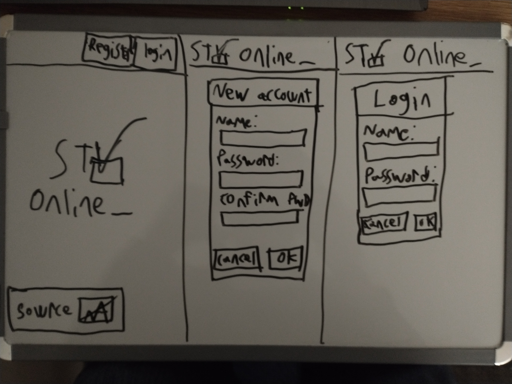
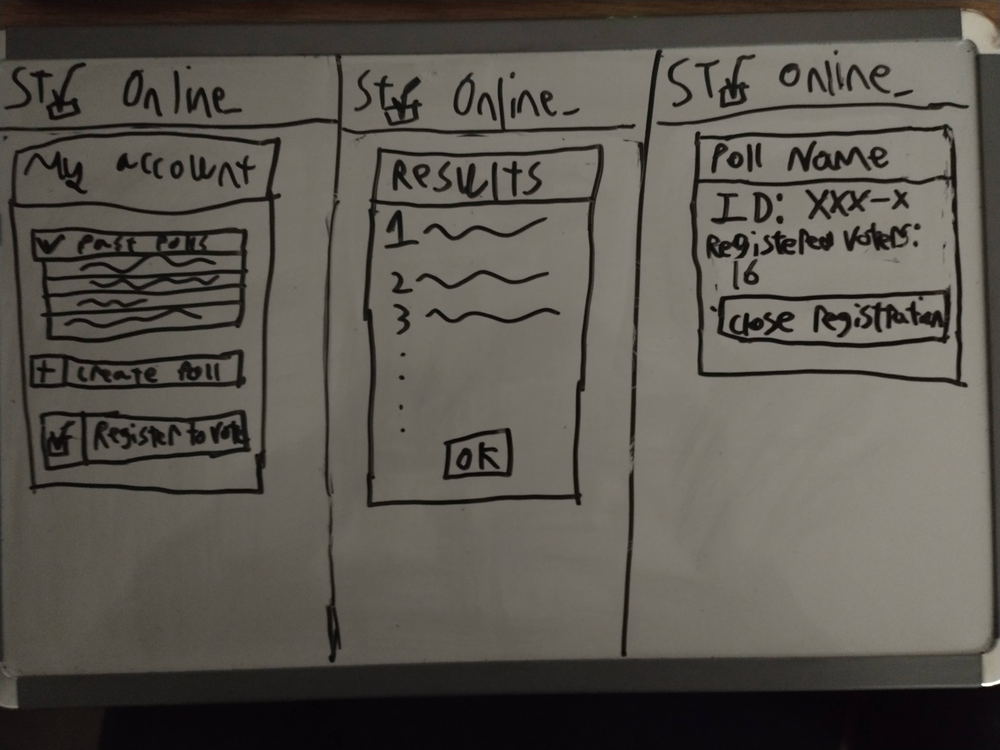
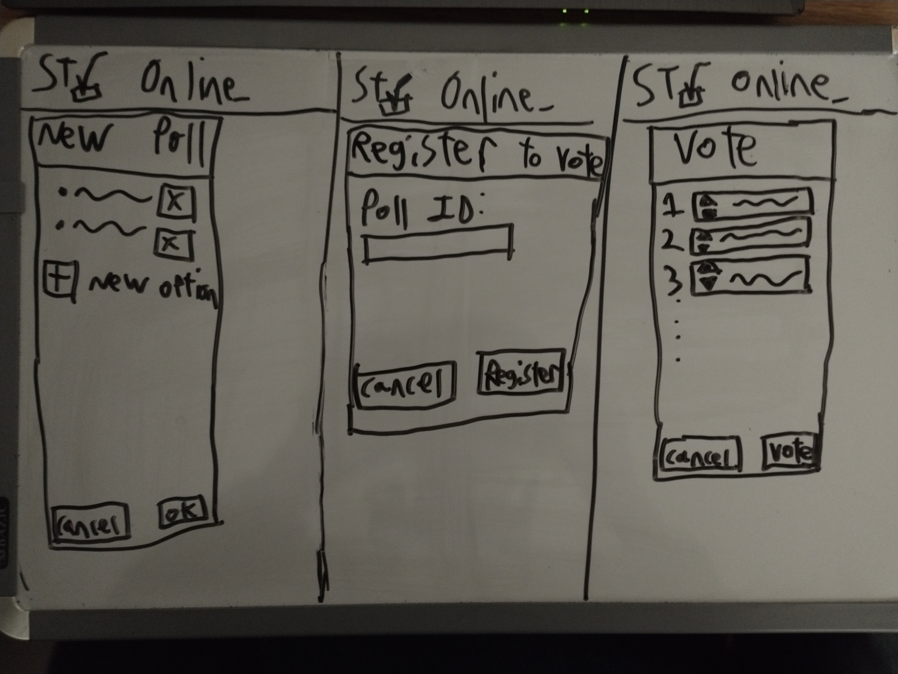

# startup
Repository for BYU CS 260 - Web Programming.  Yes, the name is generic, but the specs called for that exact string.  Oh well.

## Initial specification
### Elevator pitch
STV voting site.  Create and vote in polls using single transferable vote.
### Key features
* poll creation
* voting
* display results
### Use of focus technologies
#### HTML
* display text
* provide scaffolding to attach all the other features to
* forum could be used to submit votes
#### CSS
* everything looks better with color
* much of the voting interface would look better if it wasn't left-justified
#### JavaScript
* ripple/blink effect when an option is selected would provide more obvious feedback
* results could be given as an animation showing how they were calculated.  Shown work, basically.
#### React (JS UI framework)
* a UI framework feels like it would provide a nice simplification of the CSS and JavaScript described above.
#### Web service
##### Local services
* create account
* authenticate
* create poll
* edit poll
* submit poll
* register for poll
* close registration
* cast vote
* view results
##### External services
* Colors randomly set per poll by the Colormind API
#### Authentication
* prevent voter fraud by requiring login to vote
* provide a way to track past polls
* provide a way to create new polls
#### Database data
* user accounts
  - display name
  - credentials
  - results of polls voted in
  - polls created
* poll data
  - creator
  - options
  - colorscheme
  - results
#### WebSocket data
* clients could receive "shown work" for poll results in stages
### Concept sketches
#### Home and authentication

#### Account view, poll results, and poll administration

#### Poll creation, registering to vote, and voting

## Startup HTML deliverable
### Modifications
* Updated README.md to include modifications and deletions for Startup HTML deliverable
### Additions
* Initial deployment of Simon HTML
* GitHub repo is now linked in footers of all pages
* All pages for the website actually exist now, including login pages
* Pages all have sensible links between eachother
* Pages all have placeholder text
* Included comments to show examples of which filler data comes from the database, and which comes from a websocket
* Included placeholder for 3rd-party API call
### A note about the 3rd-party API call
My 3rd-party API of choice is [colormind.io], and cannot be included represented without CSS since it only supplies color palettes.  For the sake of meeting the placeholder requirement, I have included a CSS file with a note to this effect inside it.

## Startup CSS deliverable
### Modifications
* Updated README.md to include modifications and deletions for Startup CSS deliverable
* Updated Simon deployment to CSS
* Existing pages modified to add links to CSS pages in the `head` section
* Minor footer changes
  - GitHub link moved from "the source" to "GitHub"
  - Added my name, despite my wishes, since that was part of this deliverable's specs
  - Removed inner `span` element from `nav`, as it was an only child
* Headder changes
  - headder on logged-in pages refactored to style easier
* Poll results were changed from numeric display to `meter` display
### Additions
* CSS style sheets created
* Created form bypass links, since servers seem to redirect to `index.html` when they recieve `POST` data that they can't process rather than just ignoring the data.
### Some remarks abou the submission requirements
* #### Header, footer, and main content body
  - These are much the same as they were in the HTML version, but are present and fully functional.
* #### Navigation elements
  - Most navigation is done through the header or form submissions
  - As mentioned above, I have provided temporary links to bypass the forms since they don't work yet.
* #### Responsive to window resizing
  - From the begining, the site was designed to fit well into only a single column.  As a result of this, there is not really anything to move around on a resize.
* #### Application elements
  - These have been left largely unchanged since the HTML version of the site, with exceptions as mentioned above.
* #### Application text content
  - The text content is still the same stand-in text as it was in the HTML version.
* #### Application images
  - No image assets were added, removed, or changed since the HTML version.

## Startup React deliverable
### TODO
* Use Vite to set up template
* Set up React router
* Migrate content to React
* Ensure that all non-backend components are fully functional
### Modifications
* Updated README.md to include modifications and deletions for Startup React deliverable
* Updated Simon deployment to React
* Refactored the following into page-independant components:
	- header
	- footer
	- pollOption
	- pollResult
	- pollSumary
* Migrated the following pages from HTML to JSX:
	- index (now landing)
	- account home
### Additions